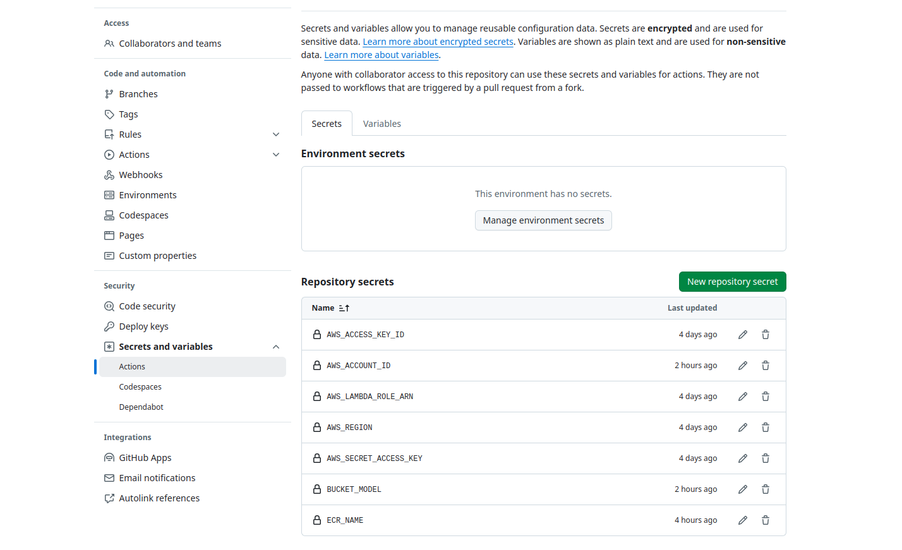

# 24-2-mlops-project-car_object_detection

## Introduction

**TO DO**

Dataset from:

https://universe.roboflow.com/openglpro/stanford_car

I used the YOLOv8 dataset

This dataset can detect both cars and bikes. I merged both train and test dataset using the script data/merge_train_test.py

## Startup

1. Install all the requirements with:

```Bash
pip install -r requirements.txt
```

Ensure Python version 3.12 is being used

> [!WARNING]
> If you would like to run with GPU, download CUDA Toolkit 12.6 https://developer.nvidia.com/cuda-downloads

2. Create .env file in the root of the repository

```Bash
ROBOFLOW_API_KEY=""
AWS_ACCESS_KEY_ID=""
AWS_SECRET_ACCESS_KEY=""
AWS_REGION=""
AWS_LAMBDA_ROLE_ARN=""
```

3. Create a S3 bucket one bucket to store the ONNX model and another one to store all the datasets from the data versioning

```Bash
python3 data/s3_bucket.py --bucket_model bucket-model-name --bucket_dataset bucket-dataset-name
```

This command will automatically save the bucket name in the .env file:

```Bash
BUCKET_MODEL="bucket-model-name"
BUCKET_DATASET="bucket-dataset-name"
```

4. Add the following variables is the "Actions secrets and variables" section at settings



> [!INFO]
> 
> ```ECR_NAME``` is the name of the ECR container
> ```BUCKET_MODEL``` is the name of the bucket were the model is stored
> 

## Steps for data versioning

Data versioning is a essencial step in any Machine Learning projects. It enables developer's teams to create multiple datasets and easily change between them when training. It is useful when the team have a lot of data and is trying to use only the samples that increase model performance. In this project [dvc](https://dvc.org/doc/api-reference) combined with git is used to implement this task. All datasets versions are stored at a S3 bucket.

### Create a new data enviroment

Sometimes, it is necessary to start everything all again. The following steps show how can you do that:

1. Remove all tags already created (remote and local)

```Bash
git push origin --delete $(git tag -l)

git tag -d $(git tag -l)
```

- Ensure the tags were erased:


2. Run data.sh to create the file "data/data.zip" with your preprocessed data. Drop value is the ratio of the dowloaded dataset that will be erased.

```Bash
./scripts/data.sh <drop_value>
```

5. Run configure_dvc.sh and pass as argument the Bucket created for the dataset

```Bash
./scrips/configure_dvc.sh bucket-dataset-name
```

After that,  you will have a tag v0.0.0 with the first version of the dataset!

### Create a new dataset version

Everytime you want to create a new dataset version, run the steps bellow:

1. Do changes in the function prepocess from [preprocess.py](./data/preprocess.py). Then, run [data.sh](./data.sh):

> [!WARNING]
> Check if you are at main:
> ```Bash
> git checkout main
> ```

```Bash
./scrips/data.sh <drop_value>
```

2. Run script that create new data version:

```Bash
./scripts/new_dataset_version.sh vA.B.C
```

3. To use a specific data version:

```Bash
git checkout vA.B.C
dvc checkout
```

## Steps for training

1. Unzip data using the command:

```Bash
unzip data/data.zip
```

2. Inside the Ultralytics folder, change it so runs are saved in the models folder of this repository. 

```Bash
cd /home/user/.config/Ultralytics

sudo vim settings.json
```

Do the following changes in settings.json:

```Json
"datasets_dir": "/home/user/your_path/24-2-mlops-project-car_object_detection",
"weights_dir": "/home/user/your_path/24-2-mlops-project-car_object_detection/models/weights",
"runs_dir": "/home/user/your_path/24-2-mlops-project-car_object_detection/models/runs",
```

3. In the root folder of the repository, start Mlflow:

```Bash
mlflow ui --backend-store-uri ./models/runs/mlflow
```


4. In another terminal, train model:

```Bash
cd src/

python3 train.py
```

This command will train the model and also save the best.onnx from the trained model inside the model S3 bucket. It will erase the file best.onnx from the bucket if it already exists. If you would like to use another YOLO model, you can run the following command (in the root of the repo):

```Bash
python3 data/s3_bucket.py --file_path /absolute_train_path/weights/best.onnx
```

5. Train again, changing hyperparameters if necessary.


6. All runs will be saved in ["models/runs"](./models/runs/)


## Steps for deploying

For deploying the model do a git push to the main. Go to the section Actions in the repository to see all the details from the workflow