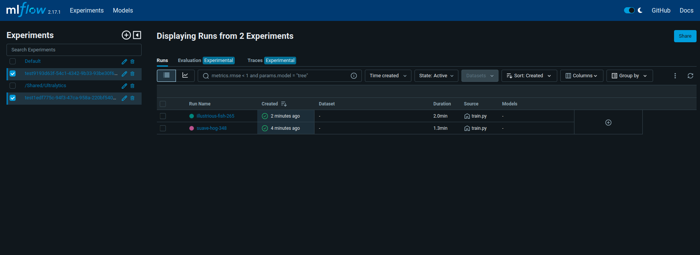

# Steps for training

Here is a step by step guide to train the model, see ["steps for data versioning"](./deploy.md)

1. Unzip data using the command:

```Bash
unzip data/data.zip
```

2. Inside the Ultralytics folder, change it so runs are saved in the models folder of this repository. 

```Bash
cd /home/user/.config/Ultralytics

sudo vim settings.json
```

Do the following changes in settings.json:

```Json
"datasets_dir": "/home/user/your_path/24-2-mlops-project-car_object_detection",
"weights_dir": "/home/user/your_path/24-2-mlops-project-car_object_detection/models/weights",
"runs_dir": "/home/user/your_path/24-2-mlops-project-car_object_detection/models/runs",
```

3. In the root folder of the repository, start Mlflow:

```Bash
mlflow ui --backend-store-uri ./models/runs/mlflow
```


4. In another terminal, train model:

```Bash
cd src/

python3 train.py
```

This command will train the model and also save the best.onnx from the trained model inside the model S3 bucket. It will erase the file best.onnx from the bucket if it already exists. If you would like to use another YOLO model, you can run the following command (in the root of the repo):

```Bash
python3 data/s3_bucket.py --file_path /absolute_train_path/weights/best.onnx
```

5. Train again, changing hyperparameters if necessary.



6. All runs will be saved in the folder models/runs


